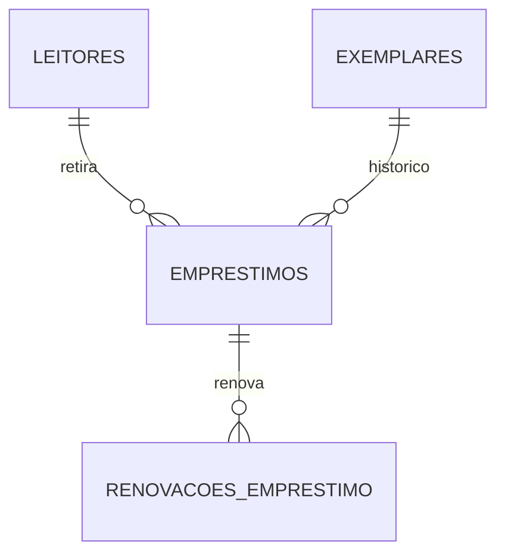

# Empréstimos e renovações — guia didático

Abra http://127.0.0.1:3001/emprestimos.html com o backend ligado.
A migração `004_emprestimos.sql` cria as tabelas desta etapa sem alterar livros ou leitores existentes.

## Regras implementadas

- Retirada na data atual, considerando o horário de Fortaleza. O servidor calcula a data.
- Prazo de 15 dias corridos: retirada em 09/10/2026, devolução até 24/10/2026.
- No máximo 5 exemplares em aberto por leitor. Atrasados também contam nesse limite.
- Somente leitor ativo e exemplar Disponível. Baixados, reservados, danificados,
  perdidos ou já emprestados são rejeitados pelo backend.
- Renovação gera novo prazo de 15 dias contados do dia da renovação, preservando a retirada original.
  Cada renovação registra data/hora, prazo anterior e novo prazo.
- Não há limite de quantidade de renovações nesta etapa. A renovação não ocupa outra vaga.
- Não se renova quando o prazo atual já cobre os próximos 15 dias. Isso evita renovações
  sem efeito no mesmo dia e impede encurtar um prazo existente.
- Empréstimos atrasados podem ser renovados. Inativos e registros encerrados não podem.
- Atrasado é uma situação calculada: previsão anterior a hoje e empréstimo ainda aberto.
  No próprio dia previsto o empréstimo ainda está no prazo.
- Não há restrição entre Centros nem bloqueio de novas retiradas por atraso nesta etapa;
  o limite de cinco continua valendo. Essas regras adicionais não foram solicitadas.

## Os blocos do código

### 1. Formulário e lista

`../emprestimos.html` contém os campos e os dois modais: cadastro e detalhes/renovação.
`../js/emprestimos.js` carrega a API, filtra a lista e preenche as opções do formulário.
Ao abrir o cadastro, as opções são consultadas novamente para reduzir o uso de dados antigos.
Os campos de busca ajudam a localizar nomes, matrículas, títulos e códigos de cópias.
O backend sempre confere as regras novamente no envio, pois outra pessoa pode ter
retirado um exemplar depois que o formulário foi aberto.

### 2. Rotas e validação

`src/app.js` define os endereços:

| Método e rota | Função |
| --- | --- |
| GET /api/emprestimos | Lista registros com situação e histórico |
| GET /api/emprestimos/opcoes | Leitores ativos, contagens, cópias disponíveis e prazo sugerido |
| GET /api/emprestimos/:id | Consulta os dados atuais de um empréstimo |
| POST /api/emprestimos | Registra a retirada |
| POST /api/emprestimos/:id/renovacoes | Renova o prazo |

`validarEmprestimo` em `src/validation.js` aceita IDs inteiros e observação de até
2000 caracteres. Não aceita datas escolhidas pelo navegador. A renovação recebe
a versão vista na tela para detectar uma alteração feita por outra sessão.

### 3. Gravação atômica

`src/repositories/emprestimos.js` concentra o SQL e as regras. A retirada usa uma transação:

1. Bloqueia a linha do leitor e confere se ele está ativo.
2. Conta empréstimos abertos e rejeita o sexto.
3. Bloqueia a linha do exemplar e confere sua disponibilidade.
4. Insere o empréstimo e muda a cópia para Emprestado.
5. Confirma tudo com COMMIT. Se qualquer etapa falhar, ROLLBACK desfaz a operação.

O bloqueio do leitor faz uma segunda retirada aguardar a primeira, mesmo sendo de
livros diferentes. Assim, dois envios simultâneos não ultrapassam o limite de cinco.
Um índice único no PostgreSQL também impede dois empréstimos abertos da mesma cópia.
A renovação bloqueia o empréstimo, verifica sua versão e grava histórico e prazo
na mesma transação. Reenvios antigos não criam renovações duplicadas.

### 4. Datas e histórico

`../js/datas.mjs` calcula a data civil de Fortaleza e soma dias corretamente ao atravessar
meses e anos. No banco, os prazos usam DATE, sem horário. As renovações têm timestamp
gerado pelo PostgreSQL para registrar o momento da ação.



## Validação e próxima etapa

Os testes automatizados usam schemas temporários separados dos cadastros reais.
Verificam limite concorrente, disputa pela mesma cópia, prazo, atraso, renovação,
histórico, leitores inativos, cópias indisponíveis e reversão em caso de erro.

```powershell
$env:RUN_POSTGRES_TESTS='1'
node --env-file=.env --test
```

A página de devoluções está disponível em `/devolucoes.html`. Ela encerra o empréstimo
e atualiza o exemplar na mesma transação; veja `DEVOLUCOES.md`. Não altere status ou
datas diretamente no banco para simular uma devolução real. Perdas durante empréstimos
precisarão de um encerramento específico. Autenticação e identificação do funcionário
responsável continuam em etapa futura.
