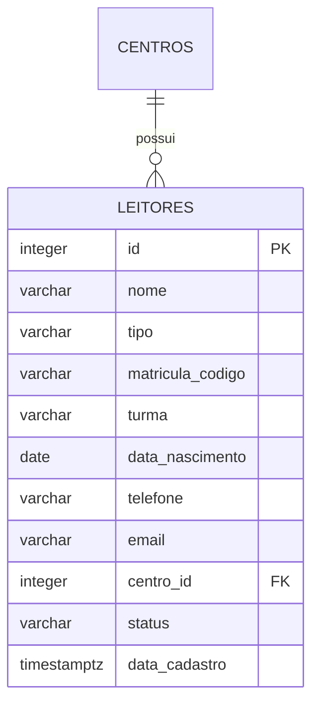

# Cadastro de leitores — guia da implementação

## Ajuste do DER

A entidade LEITOR usa `data_nascimento DATE NOT NULL` no lugar de `faixa_etaria`.
A imagem original do DER é uma referência histórica; esta descrição e a migração
`database/002_leitores.sql` registram o modelo implementado.



Nome, tipo, nascimento e Centro são obrigatórios. Tipo aceita Aluno, Professor,
Funcionário, Voluntário ou Comunidade. Contato, matrícula e turma são opcionais.
Matrícula/código, quando preenchida, é única dentro do Centro sem distinguir
maiúsculas e minúsculas. O status começa como Ativo e pode ser editado para Inativo.
Não há exclusão de leitores nesta etapa.

## Como os blocos se conectam

1. `../leitores.html` define os campos, filtros e tabela. O campo de nascimento usa
   `type="date"`; seu valor enviado é `AAAA-MM-DD`, independente da aparência do navegador.
2. `../js/leitores.js` lê o formulário, envia JSON por `fetch`, aguarda a resposta e
   só então atualiza a lista. O botão fica desabilitado durante o envio.
3. `src/app.js` recebe a requisição nas rotas GET/POST `/api/leitores` e GET/PUT
   `/api/leitores/:id`. POST cadastra; PUT edita; GET consulta.
4. `validarLeitor`, em `src/validation.js`, verifica os campos no servidor. A validação
   do navegador ajuda no preenchimento, mas não substitui a validação da API.
5. `src/repositories/leitores.js` usa parâmetros `$1`, `$2` etc. para passar os valores
   ao PostgreSQL. Nascimento é devolvido como texto de data, sem conversão de fuso.
6. `../js/datas.mjs` é compartilhado pelo navegador e backend. `calcularIdade` subtrai
   os anos e desconta um ano se o aniversário ainda não chegou. Usa a data civil
   de Fortaleza. Para nascidos em 29/02, em anos não bissextos a idade muda em 01/03.

## Por que não gravar a idade?

Se uma leitora nasceu em 07/10/2016, em 06/10/2026 tem 9 anos e em 07/10/2026
completa 10. A data de nascimento permanece igual; a idade é calculada nas consultas
e na renderização da tela. Datas inexistentes e futuras são rejeitadas.

A indicação `livros.faixa_etaria` continua no acervo. A futura pesquisa poderá
comparar a idade com as indicações dos livros. O filtro de recomendações ainda não
foi implementado: será necessário definir como tratar faixas sobrepostas,
classificação Livre e livros sem indicação. Isso não deve ser confundido com
restrição automática de empréstimo.

## Verificação

Abra `http://127.0.0.1:3001/leitores.html`, cadastre um leitor, recarregue a página,
edite e experimente os filtros. Para testar sem alterar cadastros reais, execute
no diretório backend:

```powershell
$env:RUN_POSTGRES_TESTS='1'
node --env-file=.env --test
```

Os testes de integração criam um schema temporário separado e o removem ao final.
Há verificações de persistência, matrícula duplicada, edição, status, Centro inválido,
datas futuras/inexistentes, aniversário e ano bissexto. A migração incremental pode
ser reaplicada com `node --env-file=.env scripts/migrate.js`; arquivos já registrados
em `schema_migrations` são ignorados. A etapa de autenticação permanece futura.
