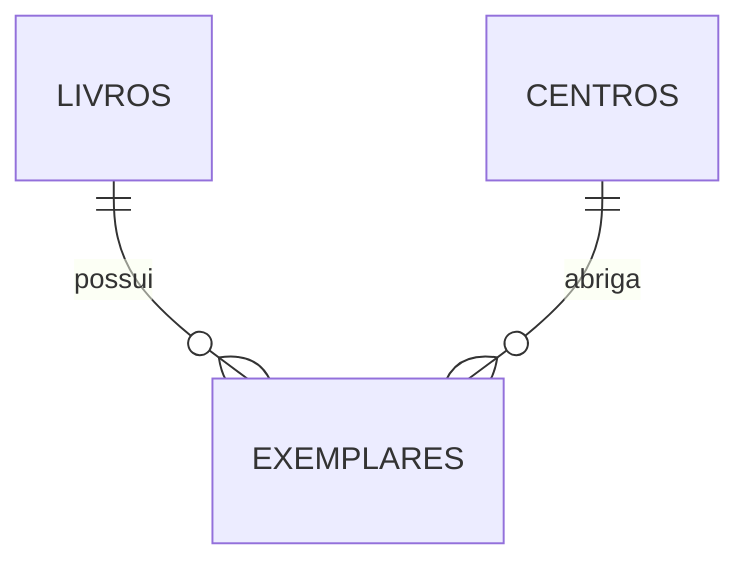

# Backend do Espaço de Leitura Digital

O acervo está integrado à API Express e ao PostgreSQL para consultar, cadastrar e editar obras e adicionar exemplares. Abra http://127.0.0.1:3001/acervo.html com o backend em execução. Não use arquivo local ou Live Server para essa página: as chamadas /api usam o mesmo endereço da página. Os antigos livros de demonstração não são importados automaticamente. A migração para Next.js será uma etapa posterior.

## Modelo do acervo



| Tabela | O que representa | Campos principais |
| --- | --- | --- |
| `livros` | Uma obra/edição cadastrada | título, autor, ISBN, editora, ano, categoria, faixa etária, capa e sinopse |
| `centros` | Um Centro de Educação | identificador e nome único |
| `exemplares` | Uma cópia física | livro, Centro, código único, localização e status |

Um livro pode possuir cópias em vários Centros. Por isso, `centro_id` pertence ao exemplar. Quantidade, disponibilidade e status geral da obra são calculados, em vez de armazenados em campos que poderiam ficar desatualizados.

O banco gera os identificadores e códigos `EX-0001`, `EX-0002` etc. Não usamos um contador do navegador, que poderia gerar códigos repetidos com várias pessoas cadastrando ao mesmo tempo. Códigos podem ter intervalos após uma transação cancelada; isso é normal. A expressão também preserva códigos com mais de quatro dígitos.

Os status físicos previstos são Disponível, Emprestado, Reservado, Danificado e Perdido. Indisponível é uma classificação geral calculada da obra. A presença de Reservado no modelo não implementa o fluxo de reservas.

ISBN é opcional e não tem restrição de unicidade nesta etapa, para não assumir uma regra sobre edições ainda não validada. Categorias e faixas etárias permanecem textuais por enquanto. Leitores, usuários, permissões e empréstimos terão suas próprias migrações depois; não há regras de prazo ou limite de empréstimos fixadas aqui.

## Organização e fluxo

```text
Requisição HTTP → rota Express → consulta SQL → PostgreSQL → resposta JSON
```

- `src/server.js`: inicia o processo na porta 3001 e fecha as conexões ao encerrar.
- `src/app.js`: define os endereços da API, valida os IDs e produz respostas HTTP.
- `src/database.js`: mantém um conjunto reutilizável de conexões, chamado pool.
- `src/repositories/acervo.js`: reúne as consultas SQL e devolve livros com seu array de exemplares.
- `database/001_acervo.sql`: define tabelas, relacionamentos e os três Centros iniciais.
- `scripts/migrate.js`: aplica o SQL em uma transação e registra a aplicação em `schema_migrations`.
- `test/api.test.js`: testa o comportamento HTTP com um banco substituto controlado.

`PRIMARY KEY` identifica um registro. `REFERENCES` exige que o livro e o Centro de um exemplar existam. `CHECK` rejeita valores inválidos. `ON DELETE RESTRICT` impede apagar uma obra ou Centro enquanto houver exemplares vinculados.

Uma transação permite criar todas as tabelas juntas ou desfazer a tentativa se houver erro. Execute a migração em um banco novo e dedicado ao projeto. Ela não apaga tabelas existentes e, após aplicada, uma nova execução informa que o banco já está atualizado. Mudanças futuras devem usar novas migrações.

## Executar a API localmente

Use Node.js 22.9 ou superior e pnpm. Os comandos abaixo são executados dentro da pasta `backend`:

```powershell
pnpm install
pnpm test
pnpm dev
```

Também é possível iniciar sem o atalho do gerenciador, depois da instalação das dependências:

```powershell
node --env-file-if-exists=.env src/server.js
```

Abra `http://127.0.0.1:3001/api/health`. A resposta `status: ok` confirma apenas que a API está rodando. A API fica restrita ao próprio computador nesta etapa e ainda não tem autenticação.

## Configurar PostgreSQL quando estiver instalado

1. Instale o PostgreSQL e crie um banco dedicado chamado `espaco_leitura` e um usuário do projeto com permissão para criar tabelas nesse banco. O PostgreSQL 18 já foi instalado neste computador, e o banco `espaco_leitura` foi criado pelo usuário; a conexão já foi autenticada e a migração inicial foi aplicada.
2. Copie `.env.example` para `.env` dentro de `backend`.
3. Preencha `PGHOST`, `PGPORT`, `PGDATABASE`, `PGUSER` e `PGPASSWORD` no `.env`. Os campos separados permitem usar a senha sem codificação de URL. Mantenha a senha entre aspas para preservar caracteres como `#`; se ela contiver aspas duplas, use aspas simples externas (ou vice-versa). Não envie credenciais pelo chat. O arquivo local foi preparado com `postgres` para esta configuração inicial; para uso da aplicação, prepare depois um usuário dedicado com permissões limitadas. Alternativamente, use `DATABASE_URL`, que tem prioridade sobre os campos separados. Em serviços hospedados, use a conexão e os certificados indicados pelo provedor, sem desativar a verificação TLS.
4. Execute `pnpm db:migrate`.
5. Inicie ou reinicie a API e abra `/api/health/db`.

O arquivo `.env` está ignorado no Git. Não crie tabelas com dados reais antes de configurar os acessos necessários. A migração inicial insere apenas CE Maranhão, CE Piauí e CE Bahia; a consulta de livros retornará `[]` até haver obras no banco.

## Endereços desta etapa

| Método e caminho | Resultado |
| --- | --- |
| `GET /api/health` | Confirma que o processo está respondendo |
| `GET /api/health/db` | Executa uma consulta real de conectividade |
| `GET /api/centros` | Lista Centros |
| `GET /api/livros` | Lista obras e seus exemplares |
| `GET /api/livros/1` | Consulta uma obra por ID |

ID inválido retorna 400; obra ou rota inexistente, 404; banco não configurado ou conexão recusada, 503; outros erros de consulta, 500. As respostas não incluem credenciais nem SQL interno.

### Gravações

- `POST /api/livros`: recebe os dados da obra, `quantidade`, `centroId` e `localizacao`; salva a obra e as cópias em uma transação e retorna 201 com o livro completo.
- `PUT /api/livros/:id`: atualiza os dados da obra e preserva os exemplares; retorna 200 com o livro completo.
- `POST /api/livros/:id/exemplares`: recebe `quantidade`, `centroId` e `localizacao`; retorna 201 com a obra atualizada.

As gravações aceitam JSON, validam os dados no servidor e usam parâmetros SQL. São permitidos lotes de 1 a 1000 cópias por envio; esse limite é operacional e não limita o total da obra. IDs e códigos vêm do banco. O estado na tela só é atualizado depois da confirmação da API. Não existe repetição automática de gravações quando a rede falha: confira o acervo antes de tentar novamente.

Express serve apenas as páginas públicas e as pastas css, js e assets. A raiz do projeto, o backend e o .env não são servidos. A interface usa a mesma origem da API; pedidos de gravação vindos de outra origem são rejeitados. Essa proteção não substitui login: a API permanece local e a autenticação ainda está pendente.

## Limites da verificação

Os testes HTTP usam respostas controladas no lugar do PostgreSQL. Eles verificam rotas, parâmetros, erros e formato da resposta; não validam a execução do SQL. A suíte automatizada não substitui testes de integração com PostgreSQL real.

Na preparação inicial, os sete testes passaram. O servidor real respondeu 200 em `/api/health`, 503 nas consultas ao banco não configurado e 400 para ID inválido. O comando de migração encerrou sem aplicar alterações por ausência de `DATABASE_URL`, como esperado.

## Referências

- [Rotas no Express](https://expressjs.com/en/guide/routing/)
- [Pool de conexões do node-postgres](https://node-postgres.com/features/pooling)
- [Consultas parametrizadas](https://node-postgres.com/features/queries)
- [Definição de dados no PostgreSQL](https://www.postgresql.org/docs/current/ddl.html)

### Integração validada em 4 de outubro de 2026

A migração foi aplicada ao banco local `espaco_leitura` no PostgreSQL 18. Foram verificadas as tabelas `livros`, `centros`, `exemplares` e `schema_migrations`, os três Centros, a geração de códigos, as consultas com exemplares e as restrições de status e relacionamentos. Reaplicar a migração não duplicou dados. As rotas `/api/health/db`, `/api/centros` e `/api/livros` responderam 200 usando o banco real.

Registros temporários de teste foram desfeitos por `ROLLBACK`; o banco permanece sem obras. As sequências de IDs avançam mesmo quando há rollback, portanto os primeiros códigos cadastrados podem não começar em 0001. Não reinicializamos essas sequências.

No PostgreSQL 18, a tentativa de excluir uma obra com exemplares retornou `23001` (`restrict_violation`); a referência a um Centro inexistente retornou `23503` e o status inválido retornou `23514`. Todas essas rejeições são esperadas.

### Integração da interface em 5 de outubro de 2026

`carregarAcervo()` usa `Promise.all` para buscar livros e Centros. `requisitarApi()` centraliza `fetch`, conversão JSON e erros. Os formulários usam `async/await` para aguardar a confirmação antes de atualizar a tela. O array `livros` agora é uma cópia dos dados consultados, e não o armazenamento definitivo.

Fluxo de um cadastro: formulário → POST /api/livros → validarObra/validarExemplares → transação SQL → resposta JSON → atualizarObraNaTela.

Oito testes passaram, incluindo integração com um schema PostgreSQL isolado: persistência, edição preservando exemplares emprestados, rollback, validações e inclusões simultâneas com códigos únicos. O teste de navegador confirmou persistência após recarga nos três formulários e erro de rede sem falso sucesso. A obra temporária criada no navegador foi removida ao final.

Para executar também os testes PostgreSQL no PowerShell, dentro de backend:

```powershell
$env:RUN_POSTGRES_TESTS='1'
node --env-file=.env --test
Remove-Item Env:RUN_POSTGRES_TESTS
```

O teste cria e remove somente um schema aleatório com prefixo `teste_acervo_`; o usuário do banco precisa ter permissão para isso. Os testes normais com `pnpm test` ignoram essa integração quando a variável não está habilitada.
